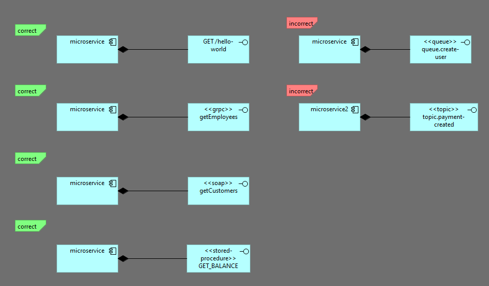

### TASK-001 интерфейсы с типом REST, gRPC, SOAP, stored procedure должны иметь композицию от сервиса

## 1. Требования:

* интерфейсы с типом REST, gRPC, SOAP, stored procedure должны иметь композицию от сервиса который обрабатывает данный запрос (с gRPC при стриминге, особенно двунаправленном надо подумать)

## 2. Проделанная работа
схема называется sync-app-interfaces-must-have-composition
метод называется validateThatSyncAppInterfacesMustHaveComposition

## 3. Тест кейсы

