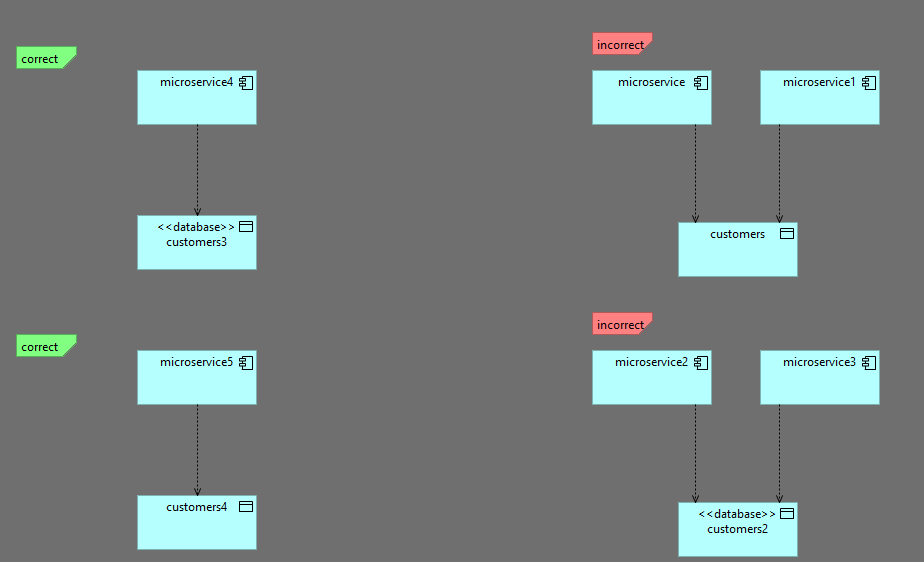

### TASK-002 Database per service

## 1. Требования:

* Database per service (нельзя обращаться к одной логической базе из нескольких сервисов при микросервисной архитектуре)

## 2. Проделанная работа
схема называется database-per-service
метод называется validateDatabasePerService

## 3. Тест кейсы

