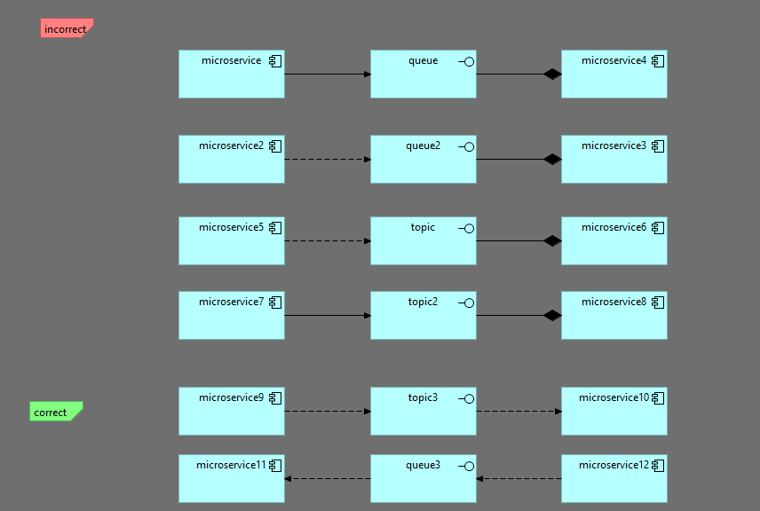

### TASK-005 queue или topic интерфейсы не должны иметь композицию от сервиса и не должны иметь триггеринг связь. Только флоу in и out

## 1. Требования:

* queue или topic интерфейсы не должны иметь композицию от сервиса и не должны иметь триггеринг связь. Только флоу in и out

## 2. Проделанная работа
схема называется queue-or-topic-only-flow-in-and-out
метод называется validateQueueOrTopicOnlyFlowInAndOut

## 3. Тест кейсы

