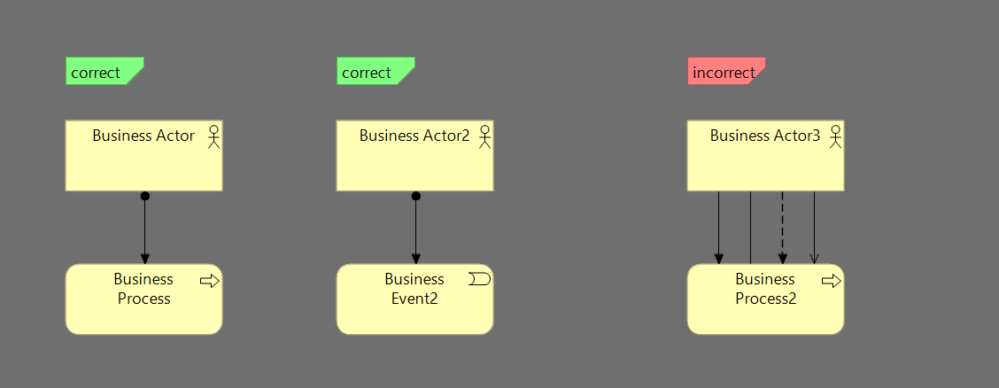

### TASK-006 Business actor только assignment выходное отношение

## 1. Требования:

* Business actor только assignment выходное отношение (может до процесса, может до события) (по событию обсудить)

## 2. Проделанная работа
схема называется business-actor-out-relations
метод называется validateBusinessActorOutRelations

## 3. Тест кейсы

