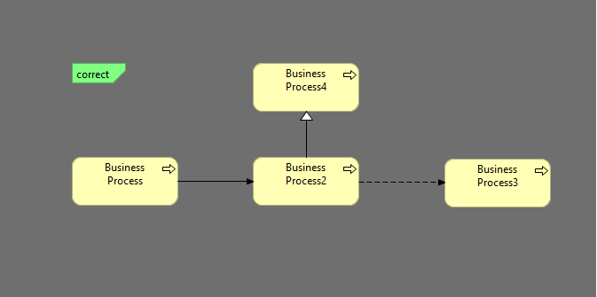

### TASK-007 Business process только flow, triggering, specialization для out relation

## 1. Требования:

* Business process только flow, triggering, specialization для out relation

## 2. Проделанная работа
схема называется business-process-out-relations
метод называется validateBusinessProcessOutRelations

## 3. Тест кейсы

