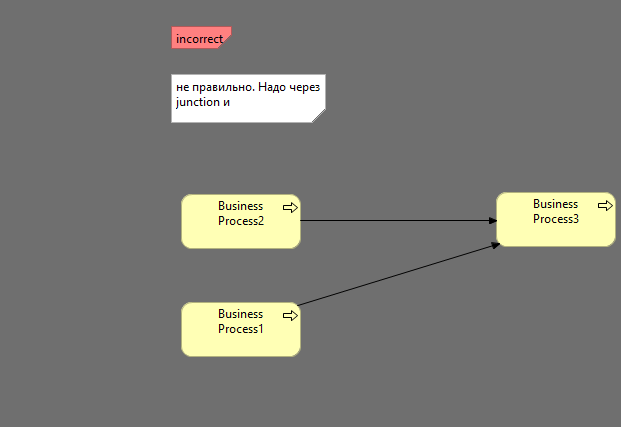
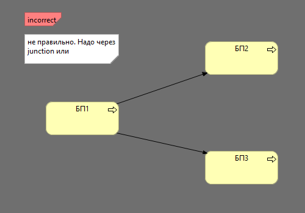

### TASK-009 Junction И/ИЛИ при нескольких связах ИЗ и В компонент

## 1. Требования:

* Junction И/ИЛИ при нескольких связах ИЗ и В компонент. 
* <b>Актуально только для слоя бизнес процессов на данный момент </b>

## 2. Проделанная работа
схемы называются \
multiple-out-relation-junction-test \
multiple-in-relations-junction-test

реализовано 2 метода, отдельно для выходящих и исходящих отношений.

validateMultipleOutRelationsOfSameTypeShouldUseJunctionInstead(); \
validateMultipleInRelationsOfSameTypeShouldUseJunctionInstead();

## 3. Тест кейсы

