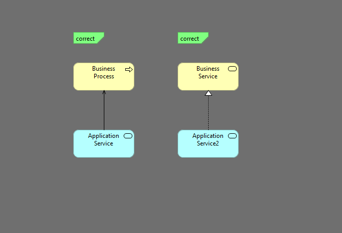

### TASK-014 application service может serve business process, realize business service

## 1. Требования:

* application service может serve business process, realize business service

## 2. Проделанная работа
схема называется app-service-has-correct-out-relations
метод называется validateAppServiceOutRelations

## 3. Тест кейсы

