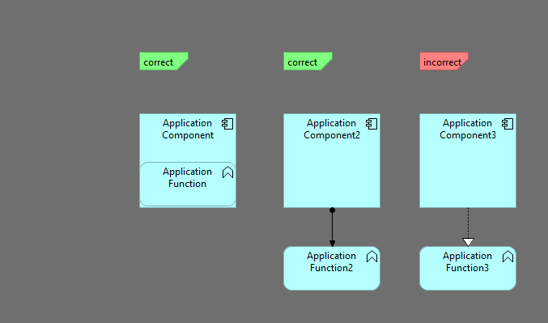

### TASK-015 application function связана через assignment

## 1. Требования:

* application function связана через assignment.

## 2. Проделанная работа
схема называется app-function-has-in-assignment
метод называется validateAppFunctionHasInAssignment

## 3. Тест кейсы

